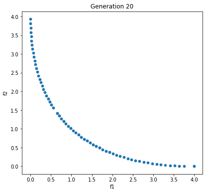
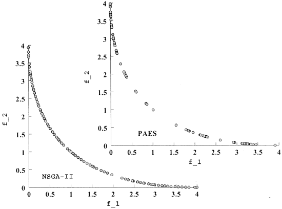
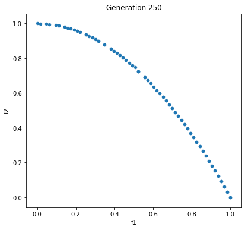
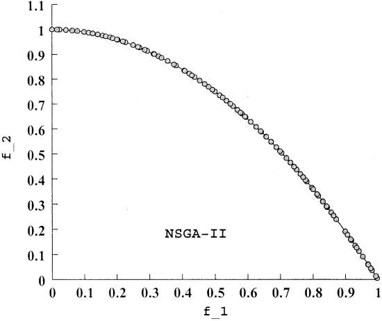

# Test NSGA-II script with Mathematical Problems 

## Introduction

This folder tests the NSGA-II algorithm with problems from [Dr. Deb's paper (2002)](<https://ieeexplore.ieee.org/document/996017>) that are developed for Multi-Objective Optimization.

### SCH Problem

The [SCH problem](<https://github.com/mehmetbercan/NSGA-II_Python_for_SWAT_model/blob/5a484051b352d55123e97c11461588b15cda682b/Tests/SCH.py#L26>) added into the Tests folder. Reached pareto front in just 20 generation since used Latin Hypercube Sampling (LHS) for the initial population. The figure bellow is generated from the [SCH.py](<https://github.com/mehmetbercan/NSGA-II_Python_for_SWAT_model/blob/5a484051b352d55123e97c11461588b15cda682b/Tests/SCH.py>) script itself.

  > The 20th Generation from the [SCH.py](<https://github.com/mehmetbercan/NSGA-II_Python_for_SWAT_model/blob/5a484051b352d55123e97c11461588b15cda682b/Tests/SCH.py>)
 

  > The SCH problem Pareto front from [Deb's paper](<https://ieeexplore.ieee.org/document/996017>)
	

### ZTD2 Problem

The [ZTD2 problem](<https://github.com/mehmetbercan/NSGA-II_Python_for_SWAT_model/blob/26ad8ea880309e43ec1baf9986bf6f2f4716ccf4/Tests/ZTD2.py#L26>) added into the Tests folder. The figure bellow is generated from the [ZTD2.py](<https://github.com/mehmetbercan/NSGA-II_Python_for_SWAT_model/blob/26ad8ea880309e43ec1baf9986bf6f2f4716ccf4/Tests/ZTD2.py>) script itself.

  > The 20th Generation from the [ZTD2.py](<https://github.com/mehmetbercan/NSGA-II_Python_for_SWAT_model/blob/26ad8ea880309e43ec1baf9986bf6f2f4716ccf4/Tests/ZTD2.py>)
 

  > The ZTD2 problem Pareto front from [Deb's paper](<https://ieeexplore.ieee.org/document/996017>)
	
	
	
************
## Notes

*  Read papers below to understand the process behind the scripts
*  Visit [my website](<http://mehmetbercan.com/research/researchCal.html>) for more information
*  If you encounter any problems or have suggestions for the future development, please contact **Mehmet B. Ercan** at mehmetbercan@gmail.com

## Credit:

Please cite one of the below articles if you use this code:

Ercan, M. B. and J. L. Goodall(2016), Design and implementation of a general software library for using NSGA-II with SWAT for multi-objective model calibration., *Environmental Modelling & Software*, 84, 112-120. doi:[10.1016/j.envsoft.2016.06.017](<http://www.sciencedirect.com/science/article/pii/S1364815216302547>).

Ercan, M. B. and J. L. Goodall (2014), A Python tool for multi-gage calibration of SWAT models using the NSGA-II algorithm., In: Ames, D.P., Quinn, N.W.T., Rizzoli, A.E. (Eds.), 2014. *Proceedings of the 7th International Congress on Environmental Modelling and Software, June 15-19, San Diego, California, USA*. (4):2325-2331, 2014. doi:[10.13140/2.1.3865.4407](<https://www.researchgate.net/publication/264373424_A_Python_Tool_for_Multi-Gage_Calibration_of_SWAT_Models_using_the_NSGA-II_Algorithm?channel=doi&linkId=53da56850cf2631430c8182a&showFulltext=true>). 
************

